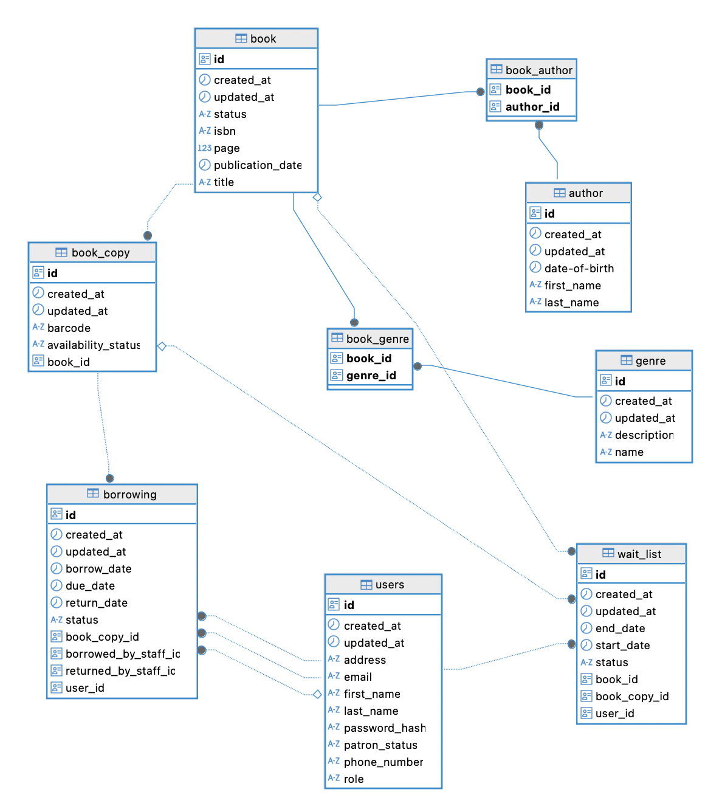

## 📚 Project Overview

The **Library Management System** is a backend application developed as part of the **Patika.dev & Getir Java Spring Boot Bootcamp**. It enables librarians to manage books, users, and the borrowing/returning process. The system also supports user registration, authentication, and role-based authorization for secure access. Built with **Spring Boot 3**, **Java 21**, and **PostgreSQL**, the project follows clean code principles, includes comprehensive API documentation, and is thoroughly tested.


## ✨ Features

### 📚 Book Management
- Add, update, delete books (Librarian only)
- View book details and list all books
- Search books by title, author, genre, or ISBN with pagination
- Real-time availability updates via Server-Sent Events (SSE)

### 🔖 Book Copy Management
- Add, update, delete individual book copies (Librarian only)
- View book copies by book or globally
- Search book copies by status, book title, etc.

### 🖋️ Author Management
- Create, update, delete authors (Librarian only)
- View all authors or a specific author
- Search authors by name or other criteria
- Associate or remove books with/from an author

### 🧩 Genre Management
- Add, update, delete genres (Librarian only)
- View all genres or a specific genre

### 👥 User Authentication
- Register new users (Patron or Librarian roles)
- Login with JWT-based authentication
- Role-based authorization for all endpoints

### 📦 Borrowing System
- Borrow book copies using barcode (Librarian)
- Return borrowed book copies (Librarian)
- Tracks borrow history, due dates, and return status

### ⏳ Waitlist System
- Patrons can place hold requests for unavailable books
- View waitlist for a specific book
- Librarians can manage and view all waitlists
- Patrons can cancel their own hold requests


## 📊 Database Schema

The application uses a PostgreSQL relational database. Below is a diagram showing the core entities and their relationships:



### Main Tables:
- **users**
- **roles**
- **books**
- **book_copies** (join table)
- **authors**
- **genres**
- **author_book** (join table)
- **borrowings**
- **waitlists**

Each entity includes auditing fields (`id`, `created_at`, `updated_at`) and foreign key constraints for data integrity.


## 🛠️ Tech Stack

| Layer           | Technology                                   |
|------------------|-----------------------------------------------|
| Language         | Java 21                                       |
| Framework        | Spring Boot 3                                 |
| Build Tool       | Maven                                         |
| Database         | PostgreSQL (production), H2 (testing)         |
| Security         | Spring Security + JWT                         |
| API Documentation| Swagger / OpenAPI                            |
| Validation       | Jakarta Bean Validation (jakarta.validation) |
| Testing          | JUnit, Spring Boot Test                       |
| Authentication   | Role-based (Librarian, Patron)               |
| Logging          | SLF4J + Logback                               |
| Reactive         | Spring WebFlux (for SSE - optional feature)   |
| Containerization | Docker, Docker Compose (optional)            |
| Version Control  | Git, GitHub (private repository)              |


## 🐳 Running the Application with Docker

You can run the entire system using Docker and Docker Compose.

### 🧩 Prerequisites
- [Docker](https://www.docker.com/)
- [Docker Compose](https://docs.docker.com/compose/)

### 🚀 Steps

```bash
# 1. Clone the project
git clone https://github.com/burakyapici747/getir-final-case.git
cd getir-final-case

# 2. Build the Docker images
docker-compose build

# 3. Start the containers in detached mode
docker-compose up -d
]
```


## 📖 API Documentation & Postman Collection

### 🔍 Swagger UI

All API endpoints are documented using **Swagger / OpenAPI**.

- Access the Swagger UI here:  
  👉 [http://localhost:8080/swagger-ui.html](http://localhost:8080/swagger-ui.html)

This interface allows you to explore, test, and understand all available endpoints in the system.

---

### 📬 Postman Collection

You can explore and test the API using the public Postman collection below:

🔗 [Open in Postman](https://elements.getpostman.com/redirect?entityId=17854443-38ac9bb2-2122-4891-b198-e00c56c5f9a9&entityType=collection)

This collection includes:
- All API endpoints grouped by functionality
- Example request bodies and expected responses
- Pre-configured variables for testing with JWT